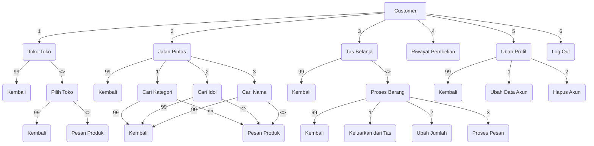
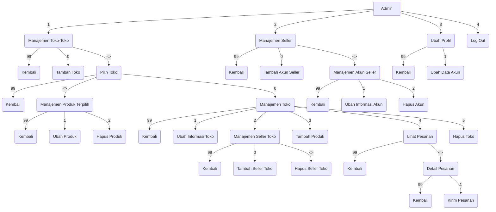
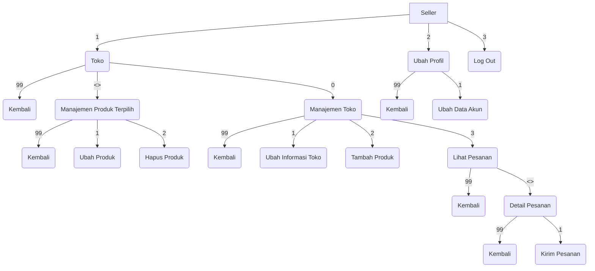

# PROJEK AKHIR PBO KELOMPOK A2-4 2021
**Sistem Manajemen Korean Market**

## Daftar Isi
* [Deskripsi](#deskripsi)
* [Alur Menu](#alur-menu)
* [Contributors](#contributors)

## Deskripsi
**Sistem Manajemen Korean Market** adalah sebuah program multi-user berbahasa pemrograman **Java** tentang pasar terkait produk-produk Korea (Selatan) berisikan banyak toko yang masing-masingnya dapat diakses oleh Costumer untuk memilih dan membeli produk diinginkan.
    
Program ini terdiri dari **tiga jenis** user yaitu **Admin, Seller, dan Customer**:
- Akun **Admin** dibuat secara *default* sementara akun **Seller** dibuat atau diregistrasikan oleh **Admin** yang nantinya akan dimasukkan ke dalam Toko, satu toko dapat memiliki lebih dari satu Seller yang memanajemen toko tersebut, akun **Customer** dapat diregistrasikan melalui menu landing.

- **Admin** satu-satunya yang dapat menambah Toko dan menambahkan seller ke dalam Toko agar Seller dapat memanajemen Toko. Admin juga dapat mengeluarkan Seller dari Toko ataupun menghapus Toko.

- **Admin dan Seller** dapat melakukan CRUD terhadap produk-produk yang dijual di Toko.
- **Customer** dapat memilih toko lalu melihat produk-produk yang dijual di toko tersebut dan memasukkan produk ke Tas Belanja.
- **Customer** dapat melihat catatan pembelian dari pembelian yang sebelumnya telah dilakukan, **Seller** dapat melihat catatan pembelian yang masuk ke tokonya, **Admin** dapat melihat catatan pembelian dari tiap-tiap toko.

       
## Alur Menu
Berikut ini dijabarkan alur menu utama setelah melakukan login sebagai Admin, Seller, atau Customer
> Tanda "<>" berarti merupakan opsi 1, 2, 3, ..., n sebanyak data yang ada, misal toko
> memiliki 5 buah produk, maka opsi <> adalah respon untuk opsi 1, 2, 3, 4, 5
    
 ### Menu Customer

Menu utama Customer terbagi menjadi 6 jalur:
* **Toko-Toko**: Customer melihat toko-toko yang ada dan kemudian memilih produk yang disediakan oleh toko terpilih.
* **Jalan Pintas**: Customer dapat mencari produk berdasarkan pilihan tertentu tanpa perlu mencari ke toko satu-persatu.
* **Tas Belanja**: Produk yang telah dipilih oleh Customer masuk ke tas belanja, Customer mengakses menu tas belanja untuk melakukan proses pembelian produk.
* **Riwayat Pembelian**: Customer melihat catatan pembelian dari produk yang sebelum-sebelumnya telah dipesan.
* **Ubah Profil**: Customer melihat, mengubah, dan/atau menghapus akun.
* **Logout**: Customer keluar dari menu utama.
  
### Menu Admin

  Menu utama Admin terbagi menjadi 4 jalur:
* **Manajemen Toko-Toko**: Admin melihat toko-toko yang ada dan menambahkan toko baru, atau melihat dan/atau mengubah atribut-atribut dan/atau produk toko yang sudah ada.
* **Manajemen Seller**: Admin melihat akun-akun seller yang ada dan melakukan CRUD pada akun seller.
* **Ubah Profil**: Admin melihat dan/atau mengubah informasi akun.
* **Logout**: Admin keluar dari menu utama.


### Menu Seller

  Menu utama Seller terbagi menjadi 3 jalur:
* **Toko**: Seller memanajemen toko yang dihubungkan dengan akunnya baik untuk mengubah informasi toko, melihat catatan pembelian, ataupun memanajemen produk toko.
* **Ubah Profil**: Seller melihat dan/atau mengubah informasi akun.
* **Logout**: Seller keluar dari menu utama.

## Contributors
Dibuat oleh Mahasiswa Universitas Mulawarman, Jurusan Informatika, Kelas A 2021, Kelompok A2-4
Dibimbing oleh Tegar Fitrah Naba Atthoriq (2009106085)
```
Contributors:
 
  Jabatan  |     NIM    |           Nama         |     Tanggung Jawab
__________________________________________________________________________
  Anggota  | 2109106037 | Agustina Dwi Maharani  | Seller, Produk
  Anggota  | 2109106039 | Ibnu Yafi Arya Wardana | Customer, Design UX
   Ketua   | 2109106040 | Natalie Fuad           | Admin
  Anggota  | 2109106043 | Hadie Pratama Tulili 	 | Autentikasi, UI
 __________________________________________________________________________
```
Untuk penjelasan penugasan lebih lanjut, baca [Contribution Guidelines](CONTRIBUTING.md/#penjelasan-tugas).
