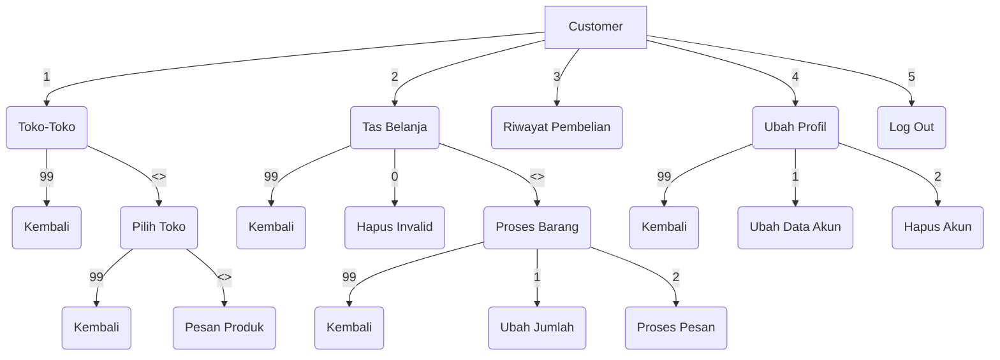
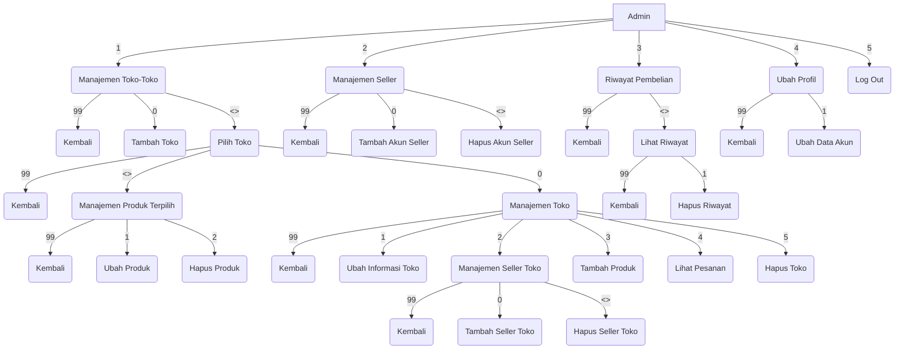

# PROJEK AKHIR PBO
**Manajemen Korean Market**
```
............................................  
Contributors:

<Anggota> 	2109106037  Agustina Dwi Maharani 		{Seller, Produk}
<Anggota> 	2109106039  Ibnu Yafi Arya Wardana 		{Customer, Design UX}
 <Ketua>	2109106040  Natalie Fuad 			{Admin}
<Anggota>	2109106042  Hadie Pratama Tulili 		{Autentikasi, UI}
............................................  
```
**Program Manajemen Korean Market** adalah sebuah program multi-user tentang pasar terkait produk-produk Korea (Selatan) berisikan banyak toko yang masing-masingnya dapat diakses oleh Costumer untuk memilih dan membeli produk diinginkan.
    
Program ini terdiri dari **tiga jenis** user yaitu **Admin, Seller, dan Customer**:
- Akun **Admin** dibuat secara ***default*** sementara akun **Seller dibuat** atau diregistrasikan oleh **Admin** yang nantinya akan dimasukkan ke dalam Toko, satu toko dapat memiliki lebih dari satu Seller yang memanajemen toko tersebut.
Akun **Customer** diregistrasikan melalui menu landing.

- **Admin** satu-satunya yang dapat menambah Toko dan menambahkan seller ke dalam Toko agar Seller dapat memanajemen Toko. Admin juga dapat mengeluarkan Seller dari Toko ataupun menghapus Toko.

- **Admin dan Seller** dapat melakukan CRUD terhadap produk-produk yang dijual di Toko.
- **Customer** dapat memilih toko lalu melihat produk-produk yang dijual di toko tersebut dan memasukkan produk ke Tas Belanja.

       
## Alur Menu
Berikut ini dijabarkan alur menu utama setelah melakukan login sebagai Admin, Seller, atau Customer
> Tanda "<>" berarti merupakan opsi 1, 2, 3, ..., n sebanyak data yang ada, misal toko
> memiliki 5 buah produk, maka opsi <> adalah respon untuk opsi 1, 2, 3, 4, 5
    
 ### Menu Customer

  
### Menu Admin

  
  ### Menu Seller

