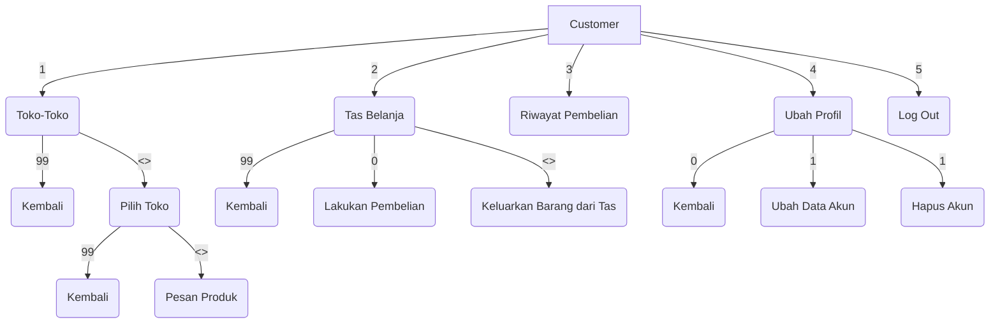
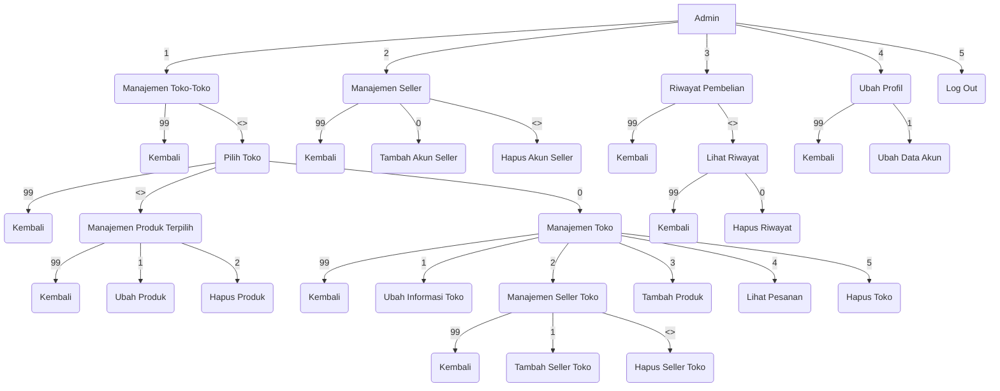
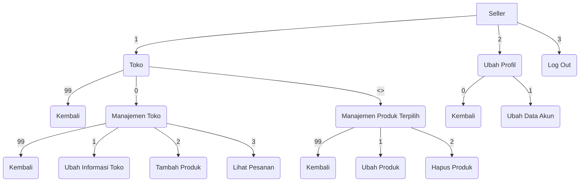

# PROJEK AKHIR PBO

```
............................................  
Anggota:  
<a> 2109106037  Agustina Dwi Maharani
<a> 2109106039  Ibnu Yafi Arya Wardana
<k> 2109106040  Natalie Fuad
<a> 2109106042  Hadie Pratama Tulili

	<a> Anggota
	<b> Ketua
............................................  
```
    
 Program ini adalah sebuah program sistem manajemen pasar (KOREAN MARKET) yang terdiri dari **tiga jenis** user yaitu **Admin, Seller, dan Customer**.
    
Alur Menu:
    




